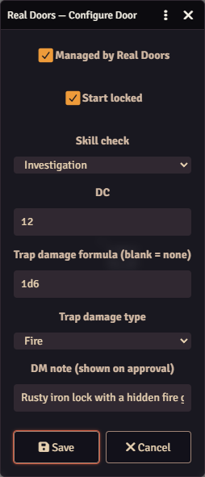
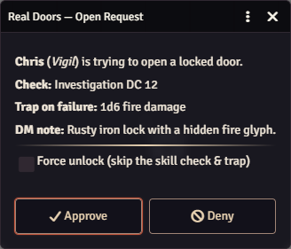

# Real Doors

Interactive, DM-authorized doors for [Foundry VTT](https://foundryvtt.com/) (dnd5e).

Real Doors turns ordinary doors into gated, skill-checked, potentially trapped obstacles.
A player who clicks a locked door doesn't just open it — the request goes to the DM, who
approves, denies, or force-unlocks. On approval the player's character auto-rolls a
configurable skill check; success swings the door open (tokens can pass), and failure
springs a configurable trap. Players or the DM can request a re-lock.

> Sibling module: [Real Chests](https://github.com/cjennison/real-chests) applies the same
> DM-authorized interaction pattern to loot containers.

## Features

- **DM-authorized opening** — a player clicking a locked, managed door sends a request to
  the DM instead of opening it. The DM sees who's attempting, the required check, the trap,
  and any private note, then chooses **Approve**, **Deny**, or **Force unlock**.
- **Automatic skill checks** — on approval the player's character rolls the configured skill
  (e.g. Thieves' Tools / Sleight of Hand / Investigation) against a DC. The roll is posted
  to chat.
- **Trapped doors** — a failed check can deal damage using any dice formula and damage type,
  applied automatically to the attempting character.
- **Force unlock** — the DM can bypass the check and trap entirely (e.g. the party disarmed
  the trap another way).
- **Real opening** — a successful open sets the door to the OPEN state, so tokens can
  actually walk through it, not just "unlocked but shut".
- **Player & DM re-lock** — a player can right-click a managed door to request a re-lock
  (DM-approved); the DM can lock any door directly.
- **Any door** — works with any wall configured as a door on any scene.

## Installation

Install via **manifest URL** in Foundry (Setup → Add-on Modules → Install Module):

```
https://github.com/cjennison/real-doors/releases/latest/download/module.json
```

Then enable **Real Doors** in your world's *Manage Modules*. Requires the **dnd5e** system.

## DM Guide

### 1. Mark a door as managed

1. Open the **Walls** scene-control layer and make sure your scene has a door
   (a wall with its *Door Type* set to *Door*).
2. Click the **Configure Real Door** toggle (door icon) in the Walls tools.
3. With the toggle active, **click a door** on the canvas to open its configuration dialog.

### 2. Configure the door

| Field | Meaning |
| --- | --- |
| **Managed by Real Doors** | Turn Real Doors handling on/off for this door. Unchecking removes management. |
| **Start locked** | Sets the door to the LOCKED state so players must request to open it. |
| **Skill check** | Which skill the character rolls on approval. Leave as *none* to open on approval with no roll. |
| **DC** | Difficulty class the roll must meet or beat. |
| **Trap damage formula** | Dice formula rolled on a failed check (e.g. `1d6`, `2d4`). Blank = no trap. |
| **Trap damage type** | Damage type applied on a failed check. |
| **DM note** | Private reminder shown to you on the approval dialog (e.g. "poison needle"). |

Click **Save**. A locked, managed door is now gated.



> Turn the **Configure Real Door** toggle back off when you're done so normal clicks
> open/close doors as usual.

### 3. Approve player attempts

When a player clicks a locked managed door, you get an approval dialog showing the attempting
player, their character, the configured check, the trap, and your note. Choose:




- **Approve** — the player's character rolls the skill vs the DC. Success opens the door;
  failure springs the trap.
- **Force unlock** (checkbox on Approve) — open directly, skipping the check and trap.
- **Deny** — the door stays locked; the player is told the DM refused.

### 4. Re-locking

- A player can **right-click** a managed door to request a re-lock; you approve or deny it.
- You can lock any door yourself with the normal Foundry right-click on the door control.

## Player Guide

- **Left-click** a locked door on your turn to ask the DM to open it. Wait for approval; your
  character then rolls automatically. On success the door opens and your token can pass.
- A **failed** roll may trigger a trap that damages your character.
- **Right-click** a managed door to ask the DM to re-lock it.

## Integrations & hooks

Real Doors broadcasts a Foundry hook on every connected client when something happens, so
other modules can react (e.g. to narrate the event). Each fires once per client with a
context payload:

| Hook | Fired when |
| --- | --- |
| `real-doors.opened` | A door is opened (skill success, or force-opened by the DM). |
| `real-doors.failed` | A player fails the check (includes trap details, if any). |
| `real-doors.relocked` | A door is re-locked. |

```js
Hooks.on("real-doors.opened", (ctx) => {
  // ctx: { character, actorId, skill, dc, roll, scene, sceneId, wallId, action, ... }
});
```

### Optional: Connection Manager (AI flavor text)

If the [Connection Manager](https://github.com/cjennison/connection-manager) module is active,
the door config gains an **On event → Connection** dropdown. Pick a connection (e.g. an
**AI Flavor Text** narrator) and, whenever that door fires an event, the enriched context is
sent to it — for example posting a short, context-aware line of narration to chat.

## Compatibility

- Foundry VTT v13+ (verified on v14).
- System: **dnd5e** 3.0.0+.
- Uses the configurable `CONFIG.Canvas.doorControlClass` for a clean subclass — no hard
  dependency on libWrapper.

## License

[MIT](LICENSE) © cjennison
